# คู่มือการกรอก Content ช่องทาง Online (Template OL_OB)

> **เวอร์ชัน 1.2 · 6 ต.ค. 2569** · ระบบ TESLA Management v2 + Tesla Admin API · ผู้ใช้งาน: **Content Maker · Content Approver · Campaign Maker / Approver**
> **ใหม่ใน 1.2:** §10.1 ปิด Campaign ถาวร + คืน Stock (กรอกจำนวนที่แจกจริง ส่วนที่เหลือคืนเข้า Stock) — ผลทดสอบ [16-campaign-close-test-report.html](16-campaign-close-test-report.html)
> **ใหม่ใน 1.1:** §8 ตรวจสอบ / อนุมัติ / ตีกลับ Content · §9 หลังอนุมัติ — เนื้อหาขึ้นเว็บลูกค้า · §10 Campaign อนุมัติ / ตีกลับ / Suspend / จอง Stock · ข้อความ error การอัปโหลดเป็นภาษาไทย · เวลาเป็นเวลาไทย
> รูปหน้าจอทุกรูปถ่ายจากการทดสอบจริงด้วย Content ทดสอบ **CT000014 — Tax Fighter 10/10 (CHN08 Broker Online)** ข้อความและรูปในตัวอย่างเป็นข้อมูลทดสอบ
> ผลการทดสอบทั้งหมดอยู่ที่ [12-online-content-test-report.md](12-online-content-test-report.md)

---

## 1. ภาพรวม

**1 Content = หน้าขายของ 1 Package ใน 1 ช่องทาง** ระบบเลือก Template ให้อัตโนมัติจากชื่อช่องทางและประเภทสินค้า

| ช่องทาง | ประเภทสินค้า | Template |
|---|---|---|
| ชื่อมีคำว่า "online" — CHN04 Direct Online, CHN07 Agent Online, CHN08 Broker Online | ประกันชีวิตสามัญ | **OL_OB** (คู่มือนี้) |
| ชื่อมีคำว่า "online" | ประกันอุบัติเหตุส่วนบุคคล | OL_PA (ดูภาคผนวก) |
| ช่องทางอื่น เช่น CHN01 Agent | ทุกประเภท | AGENT |

Template **OL_OB** มี 7 Section:

| # | Section | สิ่งที่กรอก | ที่มาของข้อมูล |
|---|---|---|---|
| 1 | Content information | ช่วงแสดงผล · URL slug · หมวดสินค้า · ลำดับ · SEO · Tag Filter | กรอกเอง + **หมวดสินค้า / Tag Filter เลือกจาก Master** |
| 2 | Thumbnail | รูปการ์ดสินค้า + ข้อความ 3 บรรทัด | อัปโหลด + กรอกเอง |
| 3 | Banner display | รูป Desktop / Mobile + Title / Sub title | อัปโหลด + กรอกเอง |
| 4 | Key Features | Icon Asset + หัวข้อจุดเด่น | อัปโหลด + **หัวข้อ เลือกจาก Master อย่างเดียว** |
| 5 | Key Advantages | Header + การ์ดจุดเด่น | กรอก Header + **การ์ด เลือกจาก Master อย่างเดียว** |
| 6 | Package recommend | Package แนะนำ | **เลือกจาก Package ที่ขายในช่องทางเดียวกัน** |
| 7 | Document Terms & Conditions | เอกสารเงื่อนไข (PDF) | อัปโหลด |

**ช่องบังคับตอนส่งอนุมัติ:** Start Date · URL slug · หมวดสินค้า · Title text (Banner display)

**สถานะ:** Draft (แก้ไขได้) → กด Submit → **รออนุมัติ** (แก้ไขไม่ได้) → อนุมัติ / ตีกลับ

---

## 2. ก่อนเริ่ม

1. มุมขวาบนต้องเป็น **Role: Content Maker** (ถ้าไม่ใช่ กดที่ป้าย Role เพื่อสลับ)
2. ป้ายสีเขียว **Tesla API** = ข้อมูลจริงจาก Tesla Admin API (ถ้าเป็นโหมด Local จะเป็นข้อมูลจำลอง)
3. เตรียมไฟล์ให้พร้อม

| ไฟล์ | ขนาดแนะนำ | ชนิด | ขนาดไฟล์สูงสุด |
|---|---|---|---|
| รูป Thumbnail | 800×600 px | JPG / PNG / SVG / WEBP | 5 MB |
| Banner Desktop | 1920×640 px | JPG / PNG / SVG / WEBP | 5 MB |
| Banner Mobile | 750×900 px | JPG / PNG / SVG / WEBP | 5 MB |
| Icon Asset (Key Features) | 800×600 px | JPG / PNG / SVG / WEBP | 5 MB |
| เอกสาร Terms & Conditions | – | PDF เท่านั้น | 10 MB / ไฟล์ · สูงสุด 10 ไฟล์ |

---

## 3. สร้าง Content ใหม่

**ขั้นที่ 1 — เปิดเมนู Package › Add Package**

หน้า Package management แสดงการ์ดสรุปจำนวนตามสถานะ และตาราง Package List

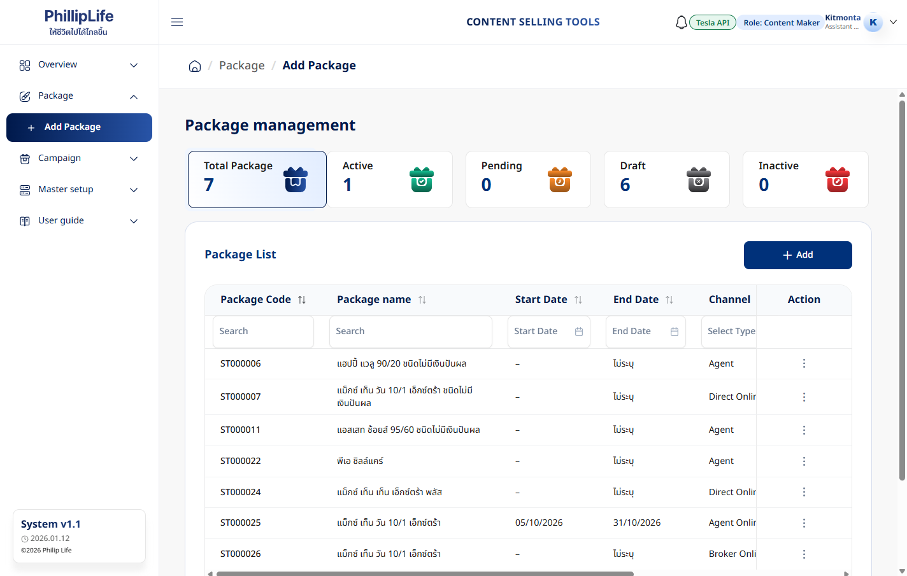

**ขั้นที่ 2 — กด "+ Add" แล้วเลือกตามลำดับ**

1. **Distribution Channel** — แสดงเฉพาะช่องทางที่ยังมี Package ที่ยังไม่มี Content
2. **Product Type** → **Sub Product Type**
3. **Package** — ตรวจการ์ดสรุป (รหัส · ชื่อ EN / TH · Sale start date · ช่องทาง)
4. กด **Save**

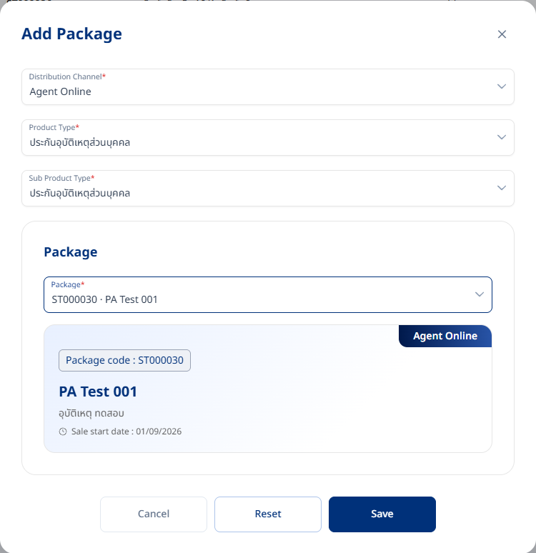

**ผลลัพธ์:** ข้อความสีเขียว "เพิ่ม Package แล้ว CTxxxxxx · STxxxxxx (Template OL_OB) — สถานะ Draft" แล้วระบบพาไปหน้า Content Editor

---

## 4. หน้าจอ Content Editor

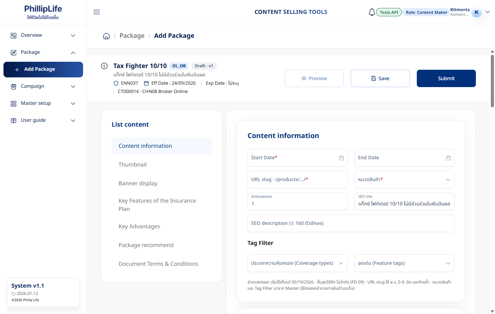

- **ส่วนหัว:** ชื่อสินค้า EN / TH · Template · สถานะ·Version · รหัสแผน · Eff / Exp Date · รหัส Content · ช่องทาง
- **ปุ่ม:** Preview (ยังไม่เปิดใช้) · **Save** (บันทึกร่าง) · **Submit** (ส่งอนุมัติ)
- **List content (ซ้าย):** กดชื่อ Section เพื่อเลื่อนไปที่ Section นั้น · เครื่องหมาย ✓ = Section กรอกครบแล้ว

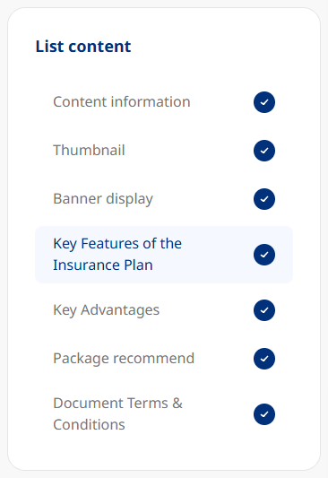

| Section | ขึ้น ✓ เมื่อ |
|---|---|
| Content information | มี Start Date + URL slug + หมวดสินค้า |
| Thumbnail | มีรูป + ข้อความอย่างน้อย 1 บรรทัด |
| Banner display | มีรูป Desktop + Mobile + Title text |
| Key Features | เลือกหัวข้ออย่างน้อย 1 แถว |
| Key Advantages | การ์ดเลือกหัวข้อแล้วอย่างน้อย 1 ใบ |
| Package recommend | เลือก Package อย่างน้อย 1 รายการ |
| Document Terms & Conditions | มีเอกสารอย่างน้อย 1 ไฟล์ |

---

## 5. กรอกทีละ Section

### 5.1 Content information

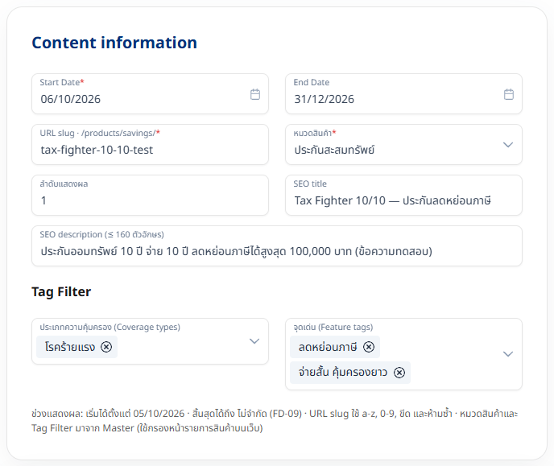

| ช่อง | วิธีกรอก / กฎ |
|---|---|
| **Start Date \*** | วันเริ่มแสดงผล — เลือกได้ตั้งแต่ **วันนี้หรือวันเริ่มขายของ Package (วันที่มากกว่า)** วันก่อนหน้าเลือกไม่ได้ |
| End Date | วันหยุดแสดงผล — ไม่เกินวันสิ้นสุดขายของ Package (ไม่ระบุ = ไม่จำกัด) และต้องไม่ก่อน Start Date |
| **URL slug \*** | ส่วนท้ายของลิงก์หน้าขาย ใช้ได้เฉพาะ **a-z, 0-9 และขีด (-)** และ**ห้ามซ้ำ**กับ Content อื่น · ป้ายของช่องแสดง Path เต็ม เช่น `/products/savings/` |
| **หมวดสินค้า \*** | เลือกจาก Master (Insurance types) เช่น ประกันสะสมทรัพย์ · ตลอดชีพ · ระยะสั้น · บำนาญ · ยูนิตลิงค์ — Path ของ URL เปลี่ยนตามหมวด |
| ลำดับแสดงผล | ลำดับในหน้ารายการสินค้า (เริ่ม 1) |
| SEO title | ไม่เกิน 70 ตัวอักษร (ค่าเริ่มต้น = ชื่อ Package ภาษาไทย) |
| SEO description | ไม่เกิน 160 ตัวอักษร |
| **Tag Filter** | เลือกได้หลายค่า จาก Master — **ประเภทความคุ้มครอง (Coverage types)** และ **จุดเด่น (Feature tags)** ใช้เป็นตัวกรองในหน้ารายการสินค้าบนเว็บ · กด ⓧ บน Chip เพื่อเอาออก |

### 5.2 Thumbnail

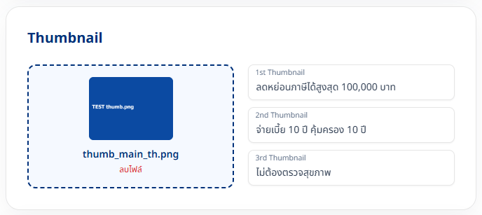

1. คลิกกรอบเส้นประ แล้วเลือกรูปการ์ดสินค้า (800×600 px ≤ 5 MB) — อัปโหลดเสร็จจะเห็นรูปตัวอย่าง · กด "ลบไฟล์" เพื่อเปลี่ยนรูป
2. กรอกข้อความบนการ์ด 1st / 2nd / 3rd Thumbnail

### 5.3 Banner display

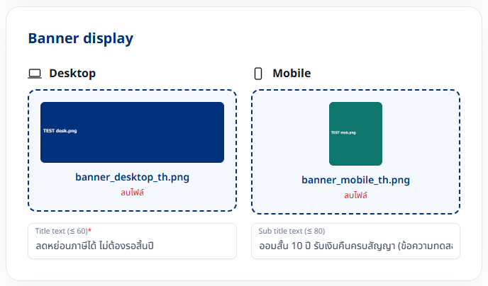

1. อัปโหลดรูป **Desktop** (1920×640 px) และ **Mobile** (750×900 px)
2. กรอก **Title text \*** (ไม่เกิน 60 ตัวอักษร) และ Sub title text (ไม่เกิน 80 ตัวอักษร)

### 5.4 Key Features of the Insurance Plan

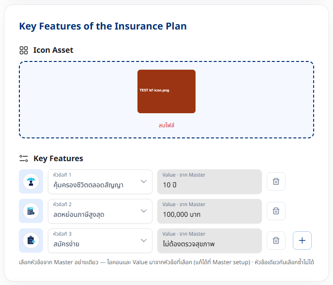

1. **Icon Asset** — อัปโหลดไอคอนของ Section
2. **Key Features** — แต่ละแถว **เลือกหัวข้อจาก Dropdown อย่างเดียว** (พิมพ์ค้นหาได้)
   - **ไอคอนและ Value มาจากหัวข้อที่เลือกโดยอัตโนมัติ** (ช่องสีเทา แก้ไม่ได้) — ถ้าต้องการแก้ข้อความ ให้แก้ที่ Master setup
   - หัวข้อที่แถวอื่นเลือกแล้วจะเป็นสีเทา **เลือกซ้ำไม่ได้**
3. ปุ่ม **+** เพิ่มแถว · ปุ่ม **ถังขยะ** ลบแถว (ต้องเหลืออย่างน้อย 1 แถว)

### 5.5 Key Advantages

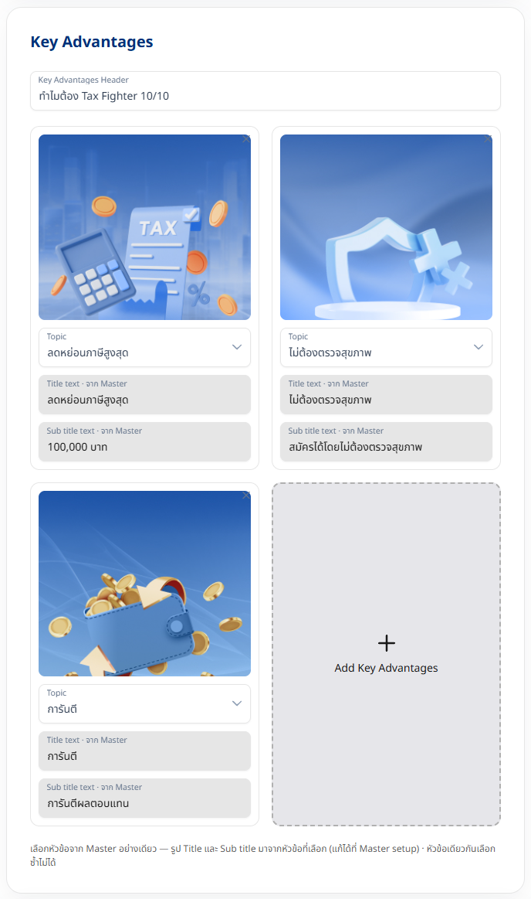

1. **Key Advantages Header** — กรอกหัวข้อของ Section เอง
2. แต่ละการ์ด **เลือก Topic จาก Dropdown อย่างเดียว** → **รูปพื้นการ์ด · Title · Sub title มาจาก Topic ที่เลือก** (แก้ไม่ได้) · Topic ซ้ำกับการ์ดอื่นไม่ได้
3. **Add Key Advantages** เพิ่มการ์ด · ปุ่ม **X** มุมขวาบนของการ์ดเพื่อลบ

### 5.6 Package recommend

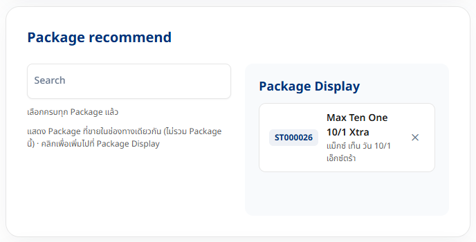

1. ฝั่งซ้ายแสดง **Package ที่ขายในช่องทางเดียวกัน** (ไม่รวม Package ของ Content นี้) — พิมพ์ในช่อง Search เพื่อค้นหาด้วยรหัสหรือชื่อ
2. **คลิก Package** → ย้ายไปอยู่ใน **Package Display** ฝั่งขวา (เรียงตามลำดับที่คลิก)
3. กด **X** ใน Package Display เพื่อเอาออก (กลับไปอยู่ฝั่งซ้าย)

ข้อความที่อาจเห็น: "ไม่มี Package อื่นในช่องทางนี้" · "ไม่พบ Package ตามคำค้น" · "เลือกครบทุก Package แล้ว"

### 5.7 Document General Terms & Conditions

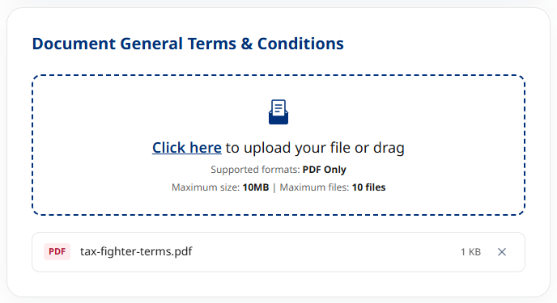

- **คลิก** กรอบ หรือ **ลากไฟล์มาวาง** — รับเฉพาะ **PDF** ไม่เกิน **10 MB** ต่อไฟล์ สูงสุด **10 ไฟล์**
- ไฟล์ที่อัปโหลดแสดงเป็นรายการ (ชื่อ · ขนาด) · กด X เพื่อลบ

---

## 6. บันทึกร่างและส่งอนุมัติ

| ปุ่ม | ผลลัพธ์ |
|---|---|
| **Save** | บันทึกร่างได้ทุกเมื่อ แม้ยังกรอกไม่ครบ → "บันทึกร่างแล้ว CTxxxxxx · เวลา" |
| **Submit** | ระบบบันทึกร่างก่อน แล้วตรวจช่องบังคับ — ถ้าครบ → สถานะ **รออนุมัติ** |

**ถ้ายังกรอกไม่ครบ** ระบบแจ้งรายการช่องที่ขาดทั้งหมดในครั้งเดียว (ข้อมูลที่กรอกไว้ยังถูกบันทึกเป็นร่าง)

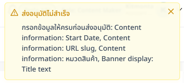

**ส่งอนุมัติสำเร็จ** ส่วนหัวแสดงสถานะ "รออนุมัติ" — ปุ่ม Save / Submit และทุกช่อง**ถูกล็อก** จนกว่าผู้อนุมัติจะอนุมัติหรือตีกลับ

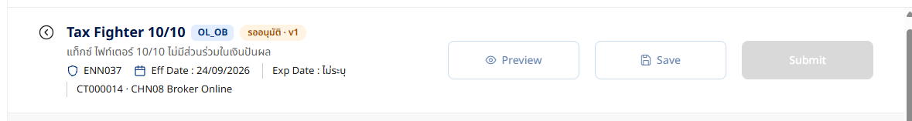

Content ที่อนุมัติแล้วจะมีปุ่ม **"สร้าง Version ใหม่"** เพื่อแก้ไข (Version เดิมยังแสดงผลจนกว่า Version ใหม่จะอนุมัติ)

**ถูกตีกลับ:** เปิด Content อีกครั้งจะเห็นแถบแดง "ตีกลับ: <เหตุผล>" ใต้ส่วนหัว — แก้ไขตามเหตุผล แล้ว Save / Submit ใหม่ (ดู §8)

---

## 7. ข้อความแจ้งเตือนที่พบบ่อยและวิธีแก้

| ข้อความ | สาเหตุ | วิธีแก้ |
|---|---|---|
| ส่งอนุมัติไม่สำเร็จ — กรอกข้อมูลให้ครบก่อนส่งอนุมัติ: … | ช่องบังคับยังว่าง | กรอกช่องตามรายการ แล้ว Submit อีกครั้ง |
| URL slug ใช้ได้เฉพาะ a-z, 0-9 และขีด (-) | มีตัวพิมพ์ใหญ่ ช่องว่าง ภาษาไทย หรือ _ | ใช้ตัวพิมพ์เล็ก ตัวเลข และขีด เช่น `tax-fighter-10-10` |
| URL slug "…" ถูกใช้แล้วใน CTxxxxxx | slug ซ้ำกับ Content อื่น | เปลี่ยน slug |
| ไฟล์ใหญ่เกิน 5 MB | รูปใหญ่เกินกำหนด | ลดขนาดไฟล์ |
| เนื้อไฟล์ไม่ตรงกับชนิดไฟล์ (เช่น เปลี่ยนนามสกุลเอง) หรือ SVG มีสคริปต์ / ลิงก์อันตราย — ใช้ไฟล์ต้นฉบับ | ไฟล์ไม่ใช่รูปจริง / นามสกุลไม่ตรงเนื้อไฟล์ | Export รูปใหม่ให้ตรงชนิด |
| ชนิดไฟล์ไม่รองรับ — รูปต้องเป็น .jpg .jpeg .png … · ไฟล์รูปใหญ่เกิน 5 MB · ไฟล์ใหญ่เกินกำหนด (ทั้งคำขอต้องไม่เกิน 11 MB …) | นามสกุล / ขนาดไม่ตรงเงื่อนไข | ใช้ไฟล์ตามชนิดและขนาดที่กำหนด |
| ….: รองรับเฉพาะไฟล์ PDF · ใหญ่เกิน 10 MB · อัปโหลดได้สูงสุด 10 ไฟล์ | เอกสารไม่ตรงเงื่อนไข | ใช้ PDF ≤ 10 MB ไม่เกิน 10 ไฟล์ |
| หมวดเดิม "…" ไม่มีใน Master — เลือกใหม่ · หัวข้อเดิม "…" ไม่มีใน Master แล้ว — เลือกหัวข้อใหม่ | Content ที่บันทึกไว้ก่อนเปลี่ยนมาเลือกจาก Master | เลือกค่าใหม่จาก Dropdown แล้ว Save |
| Start Date ต้องไม่เกิน End Date · ช่วงแสดงผลต้องอยู่ระหว่าง … | วันที่อยู่นอกช่วงที่อนุญาต | เลือกวันในช่วงที่ระบบกำหนด (ดู 5.1) |

ตัวอย่างข้อความ:

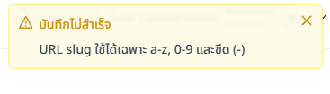

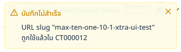

ข้อความ error ของการอัปโหลดแสดงใต้ช่องอัปโหลด (ภาษาไทย):

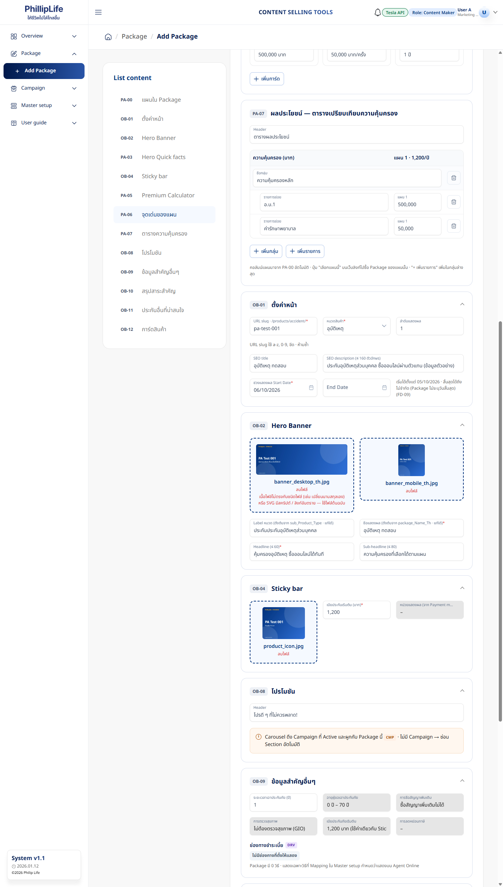

---

## 8. ตรวจสอบ / อนุมัติ / ตีกลับ Content (Content Approver)

1. สลับผู้ใช้เป็น **Content Approver** (เมนูสลับผู้ใช้มุมขวาบน) → หน้า Package management เลือก Content สถานะ **รออนุมัติ** → **ตรวจสอบ**
2. หน้า **ตรวจสอบ Content** แสดง Preview หน้าเว็บ (Desktop / Mobile) · ตารางสิ่งที่เปลี่ยนจาก Version ที่ใช้งานอยู่ (ถ้ามี) · ข้อมูลคำขอ · ประวัติ

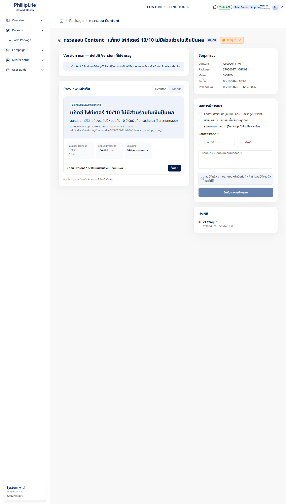

3. **อนุมัติ:** ติ๊ก 3 ข้อในกล่อง "ผลการพิจารณา" → เลือก **อนุมัติ** → **ยืนยันผลการพิจารณา**
   → "อนุมัติแล้ว CTxxxxxx v1 · เริ่มใช้งานบนหน้าเว็บ" — Content ขึ้นเว็บ**ตามวันเริ่ม (Start Date)** และ Version เดิมแสดงต่อจนถึงวันนั้น
4. **ตีกลับ:** เลือก **ตีกลับ** → ใส่เหตุผล (บังคับ · ไม่เกิน 500 ตัวอักษร) → **ยืนยันผลการพิจารณา** → Content กลับเป็น Draft และผู้สร้างเห็นเหตุผล

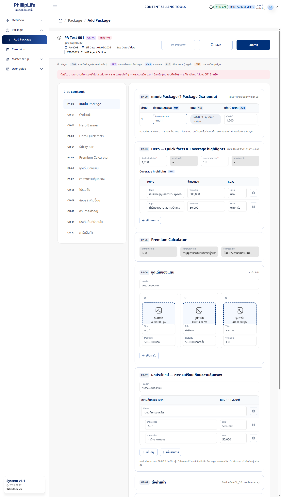

| กติกา | ข้อความที่จะเห็นถ้าไม่ผ่าน |
|---|---|
| ผู้อนุมัติต้อง**ไม่ใช่ผู้สร้างและไม่ใช่ผู้ส่ง**อนุมัติ (D-06) | อนุมัติงานที่ตัวเองสร้างหรือส่งอนุมัติไม่ได้ … |
| อนุมัติ / ตีกลับได้เฉพาะสถานะรออนุมัติ | อนุมัติได้เฉพาะ Content ที่รออนุมัติ (ตอนนี้เป็น …) |
| ตีกลับต้องมีเหตุผล | กรุณาระบุเหตุผลที่ตีกลับ |

เวลาในประวัติ / "ส่งเมื่อ" เป็น**เวลาไทย**

---

## 9. หลังอนุมัติ — เนื้อหาขึ้นเว็บลูกค้า

ตอนอนุมัติ ระบบคัดลอกเนื้อหาจาก Editor ลงตารางที่เว็บลูกค้าใช้ให้อัตโนมัติ: ชื่อ / ป้าย / คำอธิบาย · Thumbnail + ข้อความ 3 บรรทัด · Banner Desktop / Mobile + Headline · Icon · หมวดสินค้า · Tag Filter · Key Features · Key Advantages · Package recommend · เอกสาร T&C

- เว็บแสดง Version ที่อนุมัติแล้วและ**ถึงวันเริ่มตามเวลาไทย**
- หัวข้อ Key Features ของ Template AGENT ต้องตรงกับชื่อหัวข้อใน Master (Master setup) จึงจะขึ้นเว็บ
- URL slug · SEO title · ลำดับ และส่วนเฉพาะ OL_PA / AGENT (Calculator, ตารางความคุ้มครอง, จุดขาย, Sales kit …) **ยังไม่แสดงบนเว็บ** (รอทีมเว็บ) — รายละเอียด `TeslaAdminApi/docs/02_Analysis/fe-v2-content-web-mapping.md`

---

## 10. Campaign — อนุมัติ / ตีกลับ / Suspend / เปิดใช้อีกครั้ง / ปิดถาวร

หน้า **รายละเอียด Campaign** (Campaign list → คลิกรหัส Campaign)

| ผู้ใช้ | สถานะ | ปุ่ม | ผล |
|---|---|---|---|
| Campaign Approver | รออนุมัติ | **อนุมัติ** | ใช้งานทันทีตามช่วงวัน ("Approved · รอเริ่ม" ถ้ายังไม่ถึงวันเริ่ม) |
| Campaign Approver | รออนุมัติ | **ตีกลับ** → ใส่เหตุผล | กลับเป็น Draft ให้ Campaign Maker แก้ |
| Campaign Maker | Approved | **Suspend** | หยุดชั่วคราว — กรมธรรม์ใหม่ไม่ได้สิทธิ์ สิทธิ์เดิมคงอยู่ |
| Campaign Maker | Suspended | **เปิดใช้อีกครั้ง** | กลับมาใช้งาน (ตรวจช่วงวันทับซ้อนอีกครั้ง) |
| Campaign Maker | Approved / Suspended | **ปิดถาวร** → จำนวนที่แจกจริง + เหตุผล | ปิดถาวร (เปิดใช้อีกไม่ได้) · คืน Stock ส่วนที่ไม่ได้แจก — ดู §10.1 |

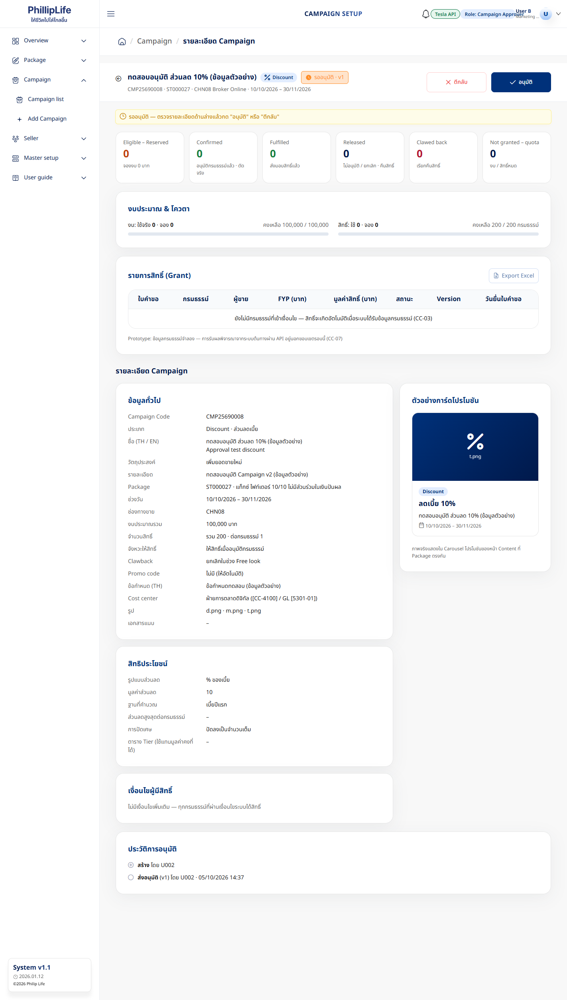

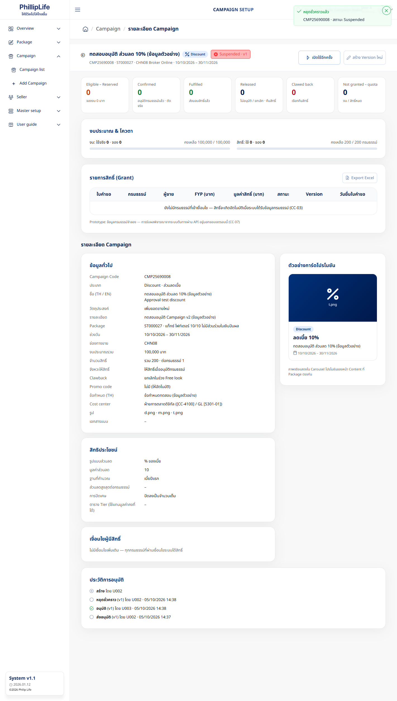

**จอง Stock (Voucher / ของรางวัล):** ตอนอนุมัติ ระบบจองจำนวน "จัดสรร" จาก Master (MS-10 Voucher / MS-16 ของรางวัล) — ประวัติแสดง "จอง Stock MS-10 VOU-001 × 150" · ถ้า Stock คงเหลือไม่พอ จะอนุมัติไม่ได้:

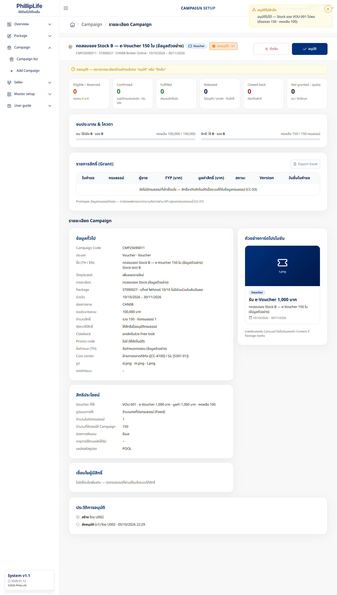

| กติกา | ข้อความ |
|---|---|
| ห้ามอนุมัติ / ตีกลับงานที่ตัวเองสร้างหรือส่ง | …งานที่ตัวเองสร้างหรือส่งอนุมัติไม่ได้ (ผู้อนุมัติต้องไม่ใช่ผู้สร้าง / ผู้ส่ง) |
| ช่วงวันทับซ้อน (ประเภทเดียวกัน × Package เดียวกัน) | ช่วงวันทับซ้อนกับ CMPxxxx … |
| Stock ไม่พอ | อนุมัติไม่ได้ — Stock ของ … ไม่พอ (ต้องจอง … · คงเหลือ …) |

### 10.1 ปิด Campaign ถาวร + คืน Stock

Stock ที่จองไว้ตอนอนุมัติจะ **ค้างอยู่จนกว่าจะปิด Campaign** — เมื่อ Campaign จบ (หมดอายุ / ยกเลิกก่อนกำหนด) ให้ Campaign Maker กด **ปิดถาวร** เพื่อบันทึกจำนวนที่แจกจริงและคืนส่วนที่เหลือ

**ตัวอย่าง:** VOU-001 มีทั้งหมด 500 ใบ · Campaign จองไว้ 150 · แจกให้ลูกค้าจริง 40 ใบ → ปิดถาวรแล้ว "ส่งแล้ว" +40 และ **คืนเข้า Stock 110 ใบ** ให้ Campaign อื่นใช้ได้

**ขั้นที่ 1** — หน้ารายละเอียด Campaign มีการ์ด **Stock ที่จองไว้** (เฉพาะ Voucher / ของรางวัลที่จอง Stock) — ระหว่างใช้งานช่อง "แจกจริง" และ "คืนเข้า Stock" เป็น –

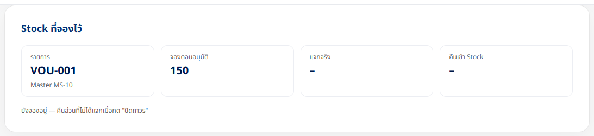

**ขั้นที่ 2** — กด **ปิดถาวร** (ปุ่มสีแดงมุมขวาบน · สถานะ Approved หรือ Suspended)

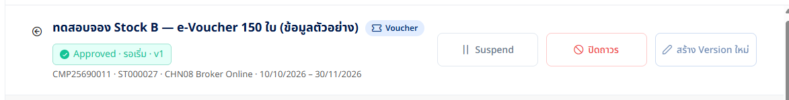

**ขั้นที่ 3** — กรอก **จำนวนที่แจกจริง** (จำนวนเต็ม 0 ถึงจำนวนที่จอง) — คลิกออกจากช่องแล้วระบบแสดงจำนวนที่จะคืน · กรอก **เหตุผลที่ปิด** แล้วกด **ปิดถาวร**
Campaign ที่ไม่ได้จอง Stock (เช่น ส่วนลด) จะถามแค่เหตุผล

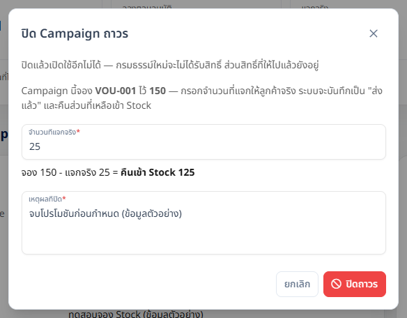

**ขั้นที่ 4** — ผลลัพธ์: สถานะเป็น **Closed** · ปุ่มทั้งหมดหายไป · แถบบนบอกผู้ปิด / เวลา / เหตุผล · การ์ด Stock แสดงจำนวนที่แจกจริงและที่คืน · ประวัติมีบรรทัด "ปิดถาวร"

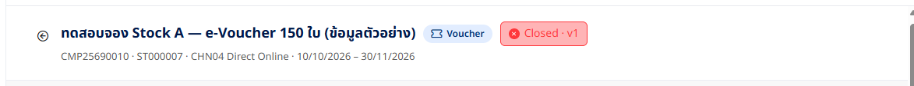

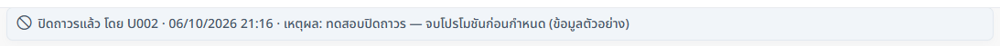

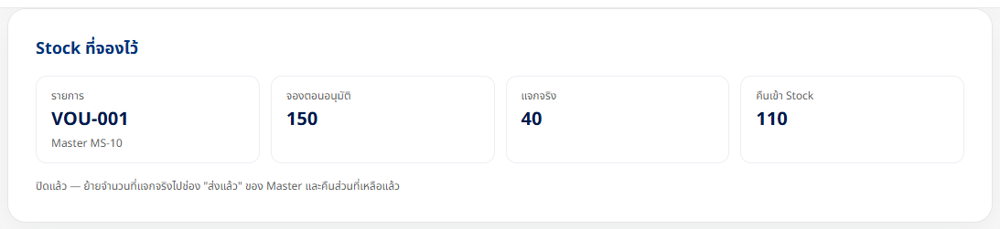

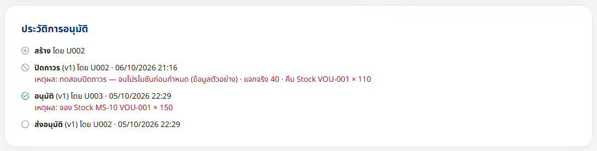

**ขั้นที่ 5** — หน้า Campaign list แสดง **Closed** (นับรวมในการ์ด Inactive) · หน้า Master setup › MS-10 / MS-16 คงเหลือเพิ่มขึ้นตามจำนวนที่คืน

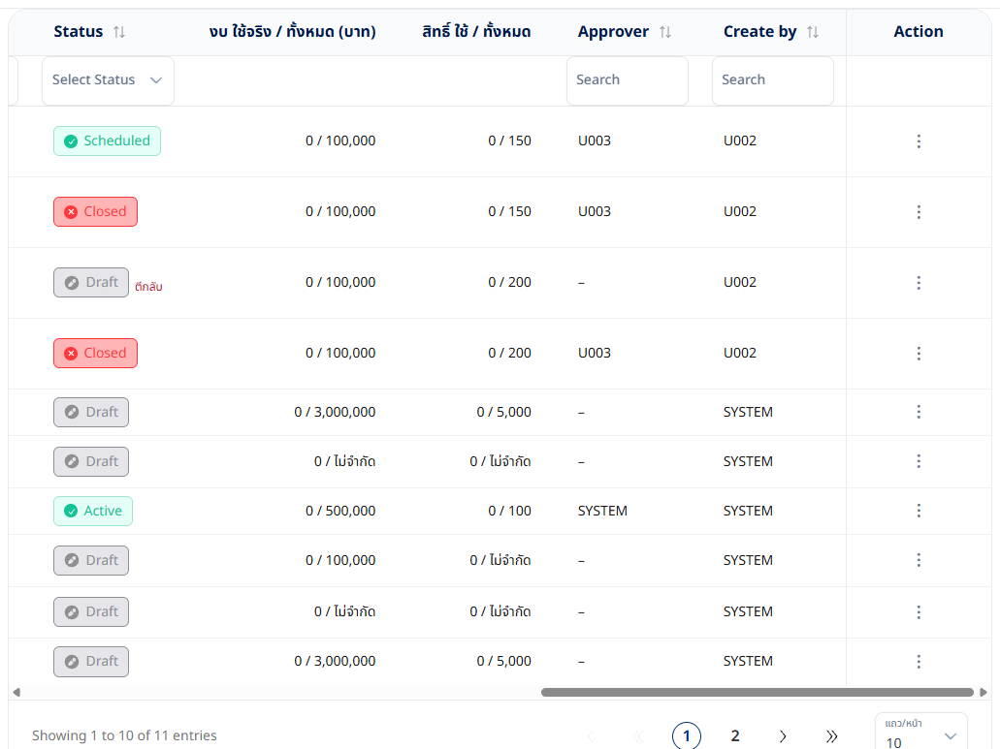

| ข้อควรรู้ | |
|---|---|
| ปิดแล้วเปิดใช้อีกไม่ได้ | ถ้าต้องการหยุดชั่วคราวให้ใช้ **Suspend** แทน (Suspend ไม่คืน Stock) |
| Campaign หมดอายุ **ไม่คืน Stock เอง** | หน้ารายละเอียดจะเตือน "หมดอายุแล้ว แต่ยังจอง Stock …" — กด ปิดถาวร เพื่อคืน |
| จำนวนที่แจกจริงมาจากผู้ใช้ | ระบบยังไม่มีบัญชีการแจกสิทธิ์ (Grant) — ตรวจยอดจากรายงานการส่ง Voucher / ของรางวัลก่อนกรอก |

| ข้อความ | สาเหตุ |
|---|---|
| กรุณาระบุเหตุผลที่ปิด Campaign | ไม่ได้กรอกเหตุผล |
| กรุณาระบุจำนวนที่แจกจริงเป็นจำนวนเต็ม 0 – … | ไม่ได้กรอก / เกินจำนวนที่จอง / มีทศนิยม |
| ปิด Campaign ได้เฉพาะสถานะ Approved / Suspended | Campaign เป็น Draft / รออนุมัติ / ปิดไปแล้ว |
| ปิด Campaign ไม่ได้ — ข้อมูล Stock ที่จองไว้เปลี่ยนไปแล้ว | มีคนแก้ข้อมูลระหว่างนั้น — เปิดหน้าใหม่แล้วทำอีกครั้ง |
---

## ภาคผนวก — Template OL_PA (ประกันอุบัติเหตุ Online)

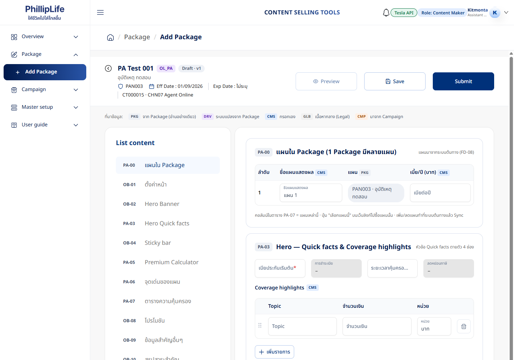

- ใช้กับช่องทาง online + ประกันอุบัติเหตุส่วนบุคคล (เช่น CHN07 Agent Online + ST000030) — มี 13 Section แบบรหัส (PA-00 แผนใน Package, OB-01 ตั้งค่าหน้า, OB-02 Hero Banner, PA-03 Quick facts …)
- ช่องบังคับตอนส่งอนุมัติ: Start Date · URL slug · หมวดสินค้า · ชื่อแสดงผล · Headline · เบี้ยประกันเริ่มต้น · ระยะเวลาคุ้มครอง
- **ยังไม่ได้ปรับเป็นการเลือกจาก Master** (หมวดสินค้ายังเป็นรายการเดิม · ไม่มี Tag Filter) — จะปรับในรอบถัดไป
